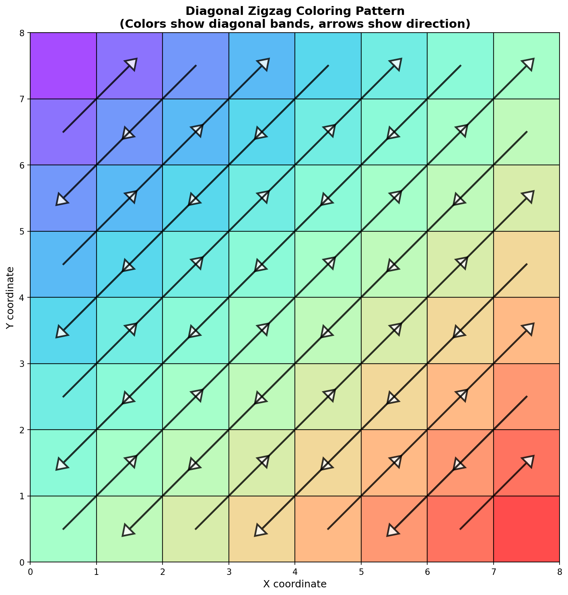

# Pattern de Coloriage Diagonal Zigzag

## Vue d'ensemble

Le mode coloriage utilise maintenant un **pattern diagonal zigzag** pour colorier les images de manière plus naturelle et dynamique. Au lieu de colorier horizontalement de gauche à droite, le coloriage suit des bandes diagonales qui alternent en direction (zigzag).

## Pourquoi le Pattern Diagonal ?

### Avantages
1. **Plus naturel** : Ressemble davantage à la façon dont on colorie réellement avec des crayons
2. **Plus dynamique** : Le mouvement diagonal crée une animation plus intéressante
3. **Meilleure couverture** : Évite l'effet de "balayage horizontal" qui peut paraître mécanique
4. **Effet artistique** : Le zigzag donne un aspect plus organique et créatif

### Comparaison

```
Pattern Horizontal (ancien) :        Pattern Diagonal Zigzag (nouveau) :
→ → → → → → →                        ↘ → ↙
→ → → → → → →                        ↘ → ↙ → ↘
→ → → → → → →                        ↘ → ↙ → ↘ → ↙
→ → → → → → →                        ↘ → ↙ → ↘ → ↙ → ↘
```

## Comment ça fonctionne

### 1. Bandes Diagonales

Les pixels sont organisés en **bandes diagonales** où la somme des coordonnées (y + x) est constante :

```
Exemple sur une grille 5x5 :

Bande 0: (0,0)
Bande 1: (0,1), (1,0)
Bande 2: (0,2), (1,1), (2,0)
Bande 3: (0,3), (1,2), (2,1), (3,0)
Bande 4: (0,4), (1,3), (2,2), (3,1), (4,0)
...
```

### 2. Effet Zigzag

Pour créer un effet zigzag naturel, les bandes alternent leur direction :

- **Bandes paires** (0, 2, 4...) : colorient de haut en bas (↘)
- **Bandes impaires** (1, 3, 5...) : colorient de bas en haut (↗)

Cela crée un mouvement de va-et-vient diagonal.

### 3. Visualisation



*Les couleurs montrent les différentes bandes diagonales, et les flèches indiquent la direction du coloriage*

## Implémentation Technique

### Algorithme

```python
# 1. Grouper les pixels par bandes diagonales
diagonal_bands = {}
for y, x in pixels:
    diagonal_index = y + x  # Même diagonale = même somme
    diagonal_bands[diagonal_index].append((y, x))

# 2. Trier les bandes
sorted_diagonals = sorted(diagonal_bands.keys())

# 3. Créer le zigzag
for i, diag_idx in enumerate(sorted_diagonals):
    if i % 2 == 0:
        # Bande paire : trier par y croissant (haut → bas)
        pixels.sort(key=lambda p: p[0])
    else:
        # Bande impaire : trier par y décroissant (bas → haut)
        pixels.sort(key=lambda p: p[0], reverse=True)
```

### Complexité

- **Temps** : O(n log n) où n est le nombre de pixels (tri)
- **Espace** : O(n) pour stocker les bandes diagonales
- **Performance** : Identique au pattern horizontal, pas de surcoût

## Exemples Visuels

### Grille Simple (8x8)

```
Ordre de coloriage avec zigzag diagonal :

  0  1  2  3  4  5  6  7
0 1  2  4  7  11 16 22 29
1 3  5  8  12 17 23 30 36
2 6  9  13 18 24 31 37 42
3 10 14 19 25 32 38 43 47
4 15 20 26 33 39 44 48 51
5 21 27 34 40 45 49 52 54
6 28 35 41 46 50 53 55 56
7 37 42 47 51 54 56 57 58

Les nombres montrent l'ordre approximatif de coloriage
```

### Animation de la Main

La main suit le pattern diagonal :

1. Commence en haut à gauche (0,0)
2. Descend en diagonale vers le bas-droite
3. Remonte en diagonale sur la bande suivante
4. Redescend sur la bande suivante
5. Continue en zigzag jusqu'à la fin

## Configuration

Aucune configuration spéciale n'est nécessaire ! Le pattern diagonal est automatique pour le mode coloriage :

```json
{
  "layers": [
    {
      "image_path": "drawing.png",
      "mode": "coloriage",
      "skip_rate": 3
    }
  ]
}
```

## Cas d'Usage Idéaux

### Parfait pour :
- 🎨 **Dessins artistiques** - Le zigzag diagonal donne un effet plus créatif
- 🖍️ **Images colorées** - Le mouvement diagonal couvre mieux les zones
- 🌈 **Illustrations** - Plus naturel que le balayage horizontal
- 📚 **Livres de coloriage** - Imite le coloriage réel avec des crayons

### Comparé au mode Draw ou Flood Fill :
- **Draw** : Meilleur pour les détails précis et textures
- **Flood Fill** : Meilleur pour les formes géométriques simples
- **Coloriage diagonal** : Meilleur pour l'effet artistique et créatif

## Tests

Pour valider le pattern diagonal :

```bash
python3 test_diagonal_coloriage.py
```

Ce test vérifie :
- ✅ La logique de tri diagonal
- ✅ L'effet zigzag
- ✅ L'intégration avec l'animation
- ✅ La création de vidéo

## Résultats de Test

```
Diagonal pattern logic:  ✅ PASSED
Coloriage diagonal mode: ✅ PASSED
Pattern visualization:   ✅ CREATED

🎉 Diagonal zigzag coloriage tests PASSED!
```

## Notes Techniques

### Propriétés Mathématiques

- **Bande diagonale** : Ensemble de pixels où y + x = k (constante)
- **Nombre de bandes** : Pour une image H×W, il y a H + W - 1 bandes
- **Taille de bande** : Variable, maximum au centre, minimum aux coins

### Performance

- Le pattern diagonal n'ajoute pas de surcoût de performance
- Le nombre de frames d'animation reste similaire au pattern horizontal
- La complexité algorithmique est identique (O(n log n))

### Compatibilité

- ✅ Compatible avec tous les paramètres existants (skip_rate, duration, etc.)
- ✅ Fonctionne avec les couches multiples
- ✅ Compatible avec les transitions et watermarks
- ✅ Pas de changement d'API nécessaire

## Comparaison Avant/Après

### Avant (Pattern Horizontal)
```
Animation : Balayage horizontal uniforme
Effet     : Mécanique, prévisible
Vitesse   : Constante sur chaque ligne
Impression: Scan ou impression
```

### Après (Pattern Diagonal Zigzag)
```
Animation : Mouvement diagonal avec zigzag
Effet     : Dynamique, créatif
Vitesse   : Varie selon la position sur la diagonale
Impression: Coloriage à la main, artistique
```

## Voir aussi

- [FLOOD_FILL_GUIDE.md](FLOOD_FILL_GUIDE.md) - Guide complet des modes d'animation
- [GUIDE_COMPLET.md](GUIDE_COMPLET.md) - Documentation exhaustive
- [test_diagonal_coloriage.py](test_diagonal_coloriage.py) - Tests du pattern diagonal

## Référence Rapide

```python
# Fonction principale
def draw_coloriage(variables, object_mask=None, skip_rate=5, black_pixel_threshold=10)

# Pattern : Diagonal zigzag
# Bandes : Groupées par y + x
# Direction : Alterne entre bandes (paires ↘, impaires ↗)
# Résultat : Animation naturelle et dynamique
```
